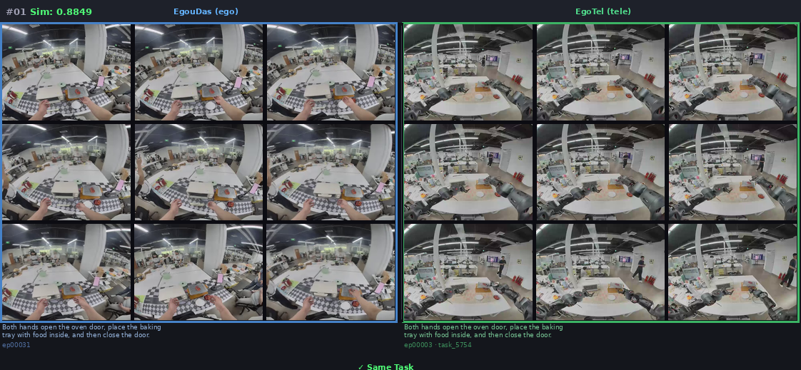
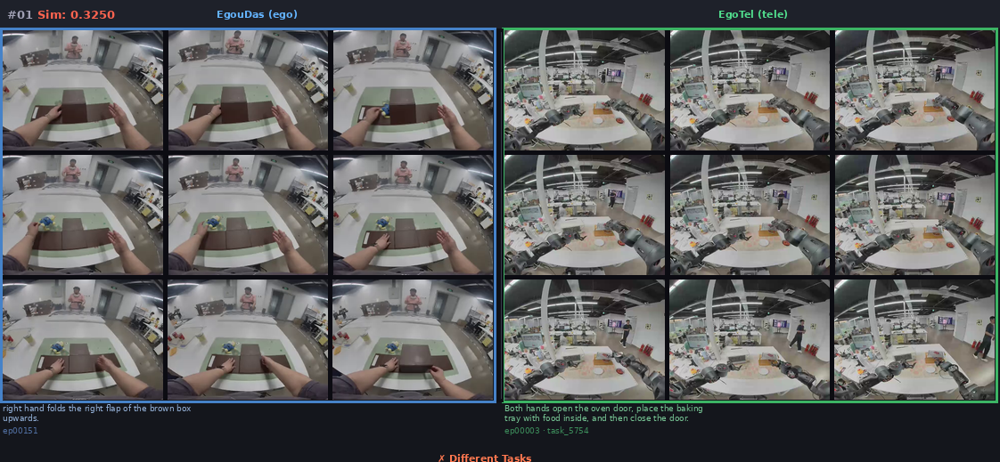

# EgoSimMatch

**Egocentric Similarity Matching** — 机器人遥操数据与人类第一视角 Egocentric 数据的相似度计算与匹配。

## 📌 项目简介

本项目旨在解决具身智能（Embodied AI）领域中，**机器人数据**与**人手的 Egocentric（第一人称视角）数据**之间的跨模态相似度计算与匹配问题。

通过对图像和文本两种模态进行 Embedding 编码（基于 Qwen3-VL-Embedding-8B），将机器人数据与人类示教数据映射到共享的语义空间，从而实现高效的相似度检索与匹配。

## 🎯 核心功能

- **EgoDex 内部匹配**：在 EgoDex 数据集内找相似任务片段
- **EgouDas × EgoTel 交叉匹配**：计算人类 ego 视角与远程操作视角的跨视角相似度（18×18 全匹配）
- **视觉-语言联合 Embedding**：每个 segment 用 9 帧图像（4秒均匀采样）+ task 文本描述编码

## 🧠 核心思路

```
人类示教数据 (Ego)         机器人数据
     │                          │
     ├── Ego 图像 ──┐           ├── 机器人图像 ──┐
     ├── Ego 文本 ──┤───▶ Embd ──┤─── 机器人文本 ──┤───▶ Embd
     └── ...        │           └── ...         │
                    │                           │
                    ▼                           ▼
            Ego Embedding               Robot Embedding
                    │                           │
                    └─────────▶ 相似度计算 ◀────────┘
                                      │
                                      ▼
                              匹配 & 检索结果
```

## 🏗️ 项目结构

```
EgoSimMatch/
├── data/               # 数据加载与预处理
│   ├── ego_data.py     # 人类 Egocentric 数据接口
│   └── robot_data.py   # 机器人数据接口
├── embeddings/         # Embedding 提取模块
│   ├── image_emb.py    # 图像 Embedding
│   └── text_emb.py     # 文本 Embedding
├── matching/           # 相似度计算与匹配
│   ├── similarity.py   # 相似度度量（余弦相似度、对比学习等）
│   └── retrieval.py    # 检索与匹配逻辑
├── models/             # 模型定义
├── config/             # 配置文件
├── scripts/            # 训练与评估脚本
├── requirements.txt    # 依赖项
└── README.md           # 本文件
```

## 🎬 可视化结果

### EgouDas × EgoTel 交叉匹配（18×18 全匹配）

**最高相似度配对 (sim=0.885)** — 同任务：



**最低相似度配对 (sim=0.325)** — 不同任务：



- 左侧：EgouDas（人类第一人称视角）
- 右侧：EgoTel（远程操作视角）
- 每个 segment：9 帧图像（4秒均匀采样）+ task 文本
- 相似度通过 Qwen3-VL-Embedding-8B 计算（视觉+语言联合编码）

## 🚀 快速开始

```bash
# 克隆仓库
git clone https://github.com/CQU-finnalweapon/EgoSimMatch.git
cd EgoSimMatch

# 安装依赖
pip install -r requirements.txt

# 运行 EgouDas × EgoTel 交叉匹配
python scripts/udas_tel_cross_match.py --device cuda:0 --batch_size 8
```

## 📚 技术栈

- Python 3.8+
- PyTorch
- Qwen3-VL-Embedding-8B（视觉-语言联合 Embedding）
- OpenCV、PIL（视频帧采样与可视化）

## 📄 许可

MIT License

## 👤 作者

[CQU-finnalweapon](https://github.com/CQU-finnalweapon)
